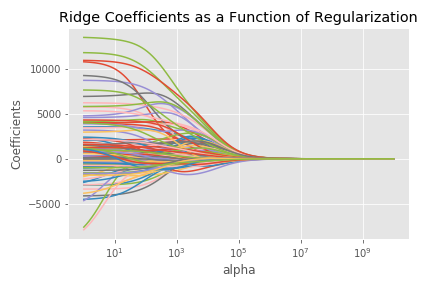
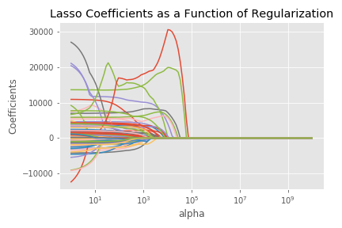
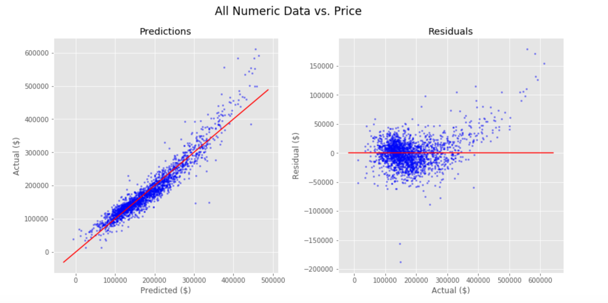
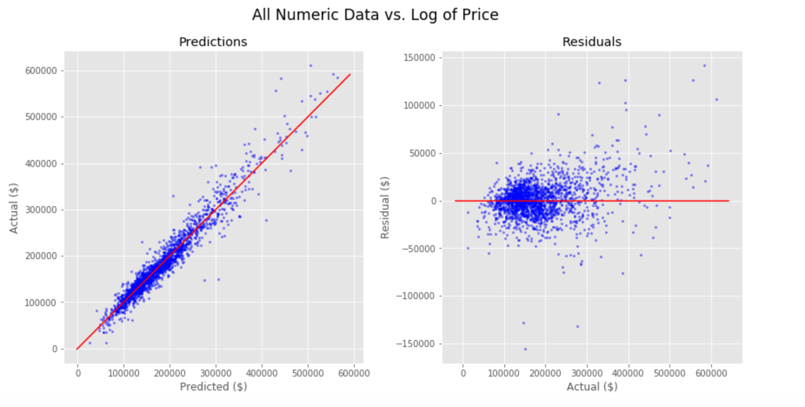
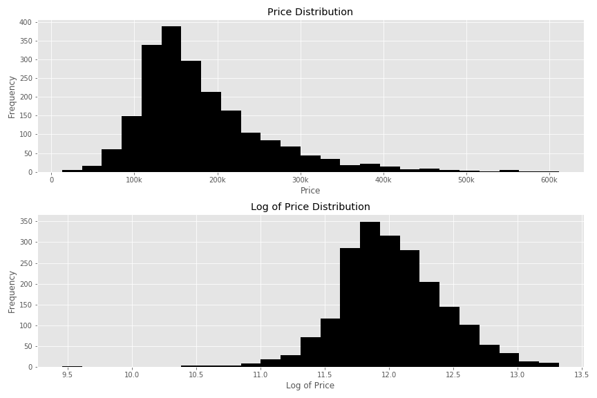
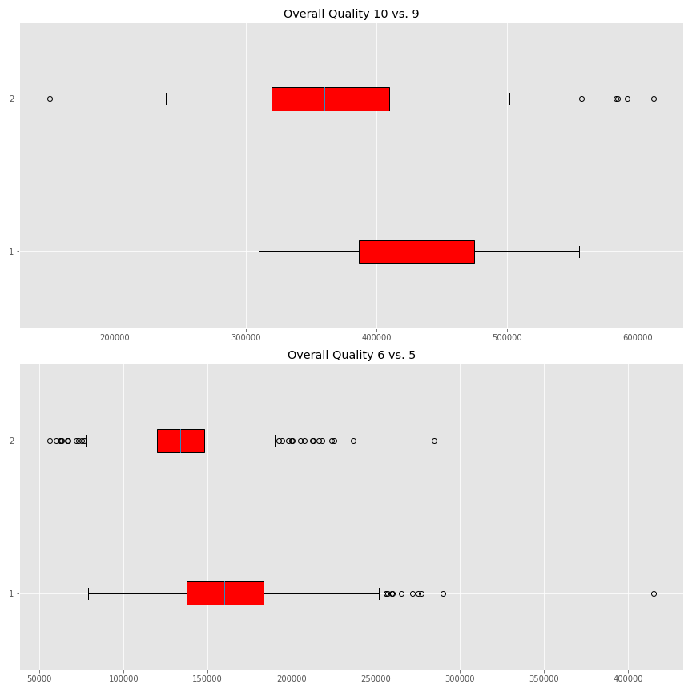

# Project 2 README

## Table of Contents
[1.0 Directory Structure](#10-Directory-Structure)<br>
[2.0 Problem Statement](#20-Problem-Statement)<br>
[3.0 Description of Data](#30-Description-of-Data)<br>
-[3.1 Size](#31-Size)<br>
-[3.2 Source](#32-Source)<br>
-[3.3 Data Dictionary](#33-Data-Dictionary)<br>
[4.0 Data Visualization](#40-Data-Visualization)<br>
[5.0 Conclusion](#50-Conclusion)<br>
[6.0 Outside Sources](#60-Outside-Sources)<br>
[7.0 Extras](#70-Extras)<br>

## 1.0 Directory Structure

```
.
├── project_2
    ├── code
        ├── p2main.ipynb
    ├── dsi-us-10-project-2-regression-challenge
        ├── datasets
        ├── sample_sub_reg.csv
        ├── test.csv
        ├── train.csv
    ├── plots
        ├── allnumeric.png
        ├── box.png
        ├── dist.png   
        ├── log.png
    ├── submissions
    ├── extras *
    ├── README.md
    └── project2_slides.pdf
```

## 2.0 Problem Statement

Here we have a robust dataset of real estate in Ames, Iowa. Using our our newly honed skills in areas including but not limited to feature engineering, polynomial feature creation, and linear regression modeling, we shall attempt to use our training data to accurately predict sale prices on a test set. In doing so, we will compete against ourselves, and our fellow General Assembly students on Kaggle.

---
## 3.0 Description of Data

### 3.1 Size
Train: 2051 rows x 81 columns <br>
Test: 878 rows x 80 columns <br>

### 3.2 Source

https://www.kaggle.com/c/dsi-us-10-project-2-regression-challenge/data

### 3.3 Data Dictionary

http://jse.amstat.org/v19n3/decock/DataDocumentation.txt

---
## 4.0 Data Visualization








---
## 5.0 Conclusion

There are many approaches one can take when creating a model for this data. In my experience, plotting all numeric data against the target provided a result that was decent, but consistently underestimated the more expensive houses. There was a slight curve in the model. Therefore the greatest benefit came from using the log of y as the target. This, combined with just a few of the best variables created from our polynomial features, is the approach that gave me the best submission.

---
## 6.0 Outside Sources

- https://stats.stackexchange.com/questions/29781/when-conducting-multiple-regression-when-should-you-center-your-predictor-varia
- https://community.alteryx.com/t5/Data-Science-Blog/Bias-Versus-Variance/ba-p/351862
- https://www.superheuristics.com/linear-regression-is-inaccurate-and-misleading/

### 7.0 Extras

Extras is in part for visualizations found online, but also there are two images containing the word "suptitle". In matplotlib, you can add a suptitle to be the overarching title for multiple subplots, but if you want the suptitle to appear higher than the subplot titles, you have to set y > 1, which causes it to get cut off when using plt.savefig(). Therefore those two plots had to be included in the slides via screenshots.
